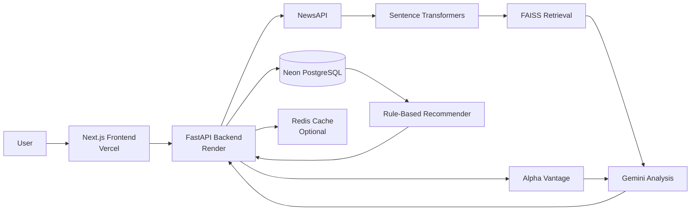

# Finance AI
A deployed full-stack stock analysis dashboard that combines market data, recent news, retrieval-augmented generation, and rule-based risk scoring to generate stock analysis, 12-month forecasts, investment reference points, and personalized stock recommendations.

> This project is for educational and informational purposes only. It is not financial advice.

## Live Demo
- Application: https://finance-ai-five-alpha.vercel.app
- Backend health check: https://finance-ai-im57.onrender.com/health

The backend may take a moment to respond after an inactive period.

## Features
- Analyze a stock using its ticker symbol
- Generate a 12-month AI-assisted price forecast
- Display reference entry point, expected return, and stop-loss values
- Summarize recent company news with source citations
- Incorporate company fundamentals into the analysis
- Customize recommendations using:
  - Risk tolerance
  - Expected annual return
  - Financial condition
  - Preferred sectors
  - Investment style
  - Holding horizon
- Rank candidate stocks using historical return, volatility, and maximum drawdown
- Support short-, medium-, and long-term recommendation horizons
- Cache market and analysis data to reduce repeated API requests

## Architecture


## How It Works
1. The user submits a ticker and investment preferences through the Next.js dashboard.
2. The FastAPI backend retrieves cached fundamentals and price data from Neon.
3. Missing fundamentals are requested from Alpha Vantage and cached in PostgreSQL.
4. Recent articles are retrieved through NewsAPI.
5. Sentence Transformers converts the news and company summary into embeddings.
6. FAISS retrieves the most relevant text for the requested stock.
7. Gemini generates the analysis, news summary, forecast, and reference investment values.
8. A separate rule-based model ranks stocks using:
   - Annualized historical return
   - Annualized volatility
   - Maximum drawdown
   - Sector preference
   - Risk tolerance
   - Investment style
   - Holding horizon
9. The combined result is returned to the dashboard.

## Recommendation Horizons
| Horizon | Historical Window |
|---|---:|
| Short term | 63 trading days |
| Medium term | 252 trading days |
| Long term | 756 trading days |

The recommendation engine scores up to 50 candidate stocks with sufficient historical data. User preferences affect the recommendation ranking but do not alter the analyzed stock’s forecast.

## Data Sources
- **Alpha Vantage** — company fundamentals and recent daily market data
- **Stooq** — historical OHLCV data used to build the original price database
- **NewsAPI** — recent company and market news
- **Neon PostgreSQL** — persistent storage for prices, fundamentals, jobs, and precomputed stock features
- **Gemini API** — structured analysis and forecast generation

Fundamental data is cached to reduce external API usage. If a provider is temporarily unavailable or rate-limited, the backend returns a transparent fallback instead of inventing missing financial values.

## Technology Stack
### Frontend
- Next.js 14
- React 18
- TypeScript
- Tailwind CSS
- Recharts
- Axios
- Vercel

### Backend
- Python 3.12
- FastAPI
- Uvicorn
- Pydantic
- PostgreSQL / Neon
- Redis
- Docker
- Render

### AI and Data
- Google Gemini
- Sentence Transformers
- FAISS
- NumPy
- pandas
- NLTK
- Alpha Vantage
- NewsAPI

## API Endpoints
| Method | Endpoint | Description |
|---|---|---|
| `GET` | `/health` | Service health check |
| `POST` | `/api/analyze` | Run a synchronous stock analysis |
| `POST` | `/api/start-analysis` | Start a background analysis job |
| `GET` | `/api/status/{job_id}` | Retrieve background job status |

## Local Development
### Prerequisites
- Python 3.12
- Node.js 18 or later
- PostgreSQL database
- Optional Redis instance
- Alpha Vantage, NewsAPI, and Gemini API keys

### Backend setup
```bash
cd backend
python -m venv .venv
```

Activate the environment:

```bash
# Windows
.venv\Scripts\activate

# macOS/Linux
source .venv/bin/activate
```

Install dependencies:

```bash
pip install -r requirements.txt
```

Create `backend/.env`:

```env
DATABASE_URL=your_postgresql_connection_string
GEMINI_API_KEY=your_gemini_api_key
YOUR_API_KEY=your_newsapi_key
ALPHA_VANTAGE_API_KEY=your_alpha_vantage_api_key
REDIS_URL=redis://localhost:6379/0
```

Create the database tables:

```bash
python create_tables.py
```

Start the API:

```bash
uvicorn api_server:app --reload --port 8001
```

### Frontend setup
```bash
cd frontend
npm install
```

Create `frontend/.env.local`:

```env
NEXT_PUBLIC_API_URL=http://localhost:8001
```

Start the frontend:

```bash
npm run dev
```

Open http://localhost:3000.

## Docker
The backend and Redis can be started with Docker Compose:

```bash
docker compose up --build
```

The backend will be available at http://localhost:8001.

## Deployment
- The Next.js frontend is deployed on Vercel.
- The Dockerized FastAPI backend is deployed on Render.
- PostgreSQL data is hosted on Neon.
- Production secrets are stored as platform environment variables and are not committed to Git.

## Current Limitations
- Alpha Vantage’s free tier limits the number of uncached fundamental requests per day.
- Some stocks may have incomplete sector metadata.
- Recommendation quality depends on the available historical data and candidate universe.
- AI-generated forecasts are not guaranteed predictions of future market performance.
- News quality depends on the articles returned by the external provider.

## Future Improvements
- Curate the recommendation universe using liquidity and market-cap filters
- Pre-cache fundamentals for frequently analyzed stocks
- Add automated tests and continuous integration
- Add scheduled market-data refresh jobs
- Improve source-quality filtering for news retrieval
- Evaluate forecast behavior against historical baselines

## Contributors
Built collaboratively by the repository contributors.
